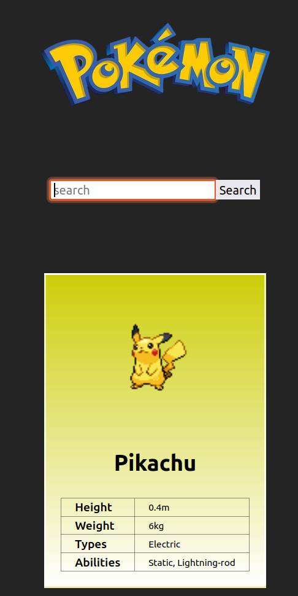

<a id="search-app"></a>

# Pokémon Search App

A simple React application that allows users to search for Pokémon by name and display their details, including an image, height, and weight. The application fetches data from the [ Pokéapi ](https://pokeapi.co/)

## Features

- Search for Pokémon by name.
- Display Pokémon details: name, image, height, and weight.
- Error handling for invalid Pokémon names and empty input.

#### Screenshot



## Technology Used

- **React**: Frontend library for building the user interface.
- **TypeScript**: Type-safe programming language for better development experience.
- **CSS**: For styling the components.

## Getting Started

### Prerequisites

Make sure you have the following installed on your machine:

- [Node.js](https://nodejs.org/) (includes npm)
- A code editor (e.g., [Visual Studio Code](https://code.visualstudio.com/))

### Installation

1. Clone the repository:

```bash
git clone <repository-url>
```

2. Install the dependencies:

```bash
npm install
```

### Running the Application

To start:

```bash
npm run dev
```

## Usage

1.  Type the name of a Pokémon in the search input field.
2.  Click the "Search" button or press Enter to fetch the Pokémon data.
3.  If the Pokémon exists, its details will be displayed; otherwise, an error message will be shown.

## Error Handling

- If the search input is empty, an error message prompts the user to enter a Pokémon name.
- If the entered Pokémon does not exist, an error message is displayed indicating that the Pokémon was not found.

## Acknowledgments

- [PokéAPI](https://pokeapi.co/) for providing the Pokémon data.
- [React](https://reactjs.org/) and [TypeScript](https://www.typescriptlang.org/) for the amazing development experience.

<p align="right"><a href="#search-app"><i>back to top ↑</i></a></p>
